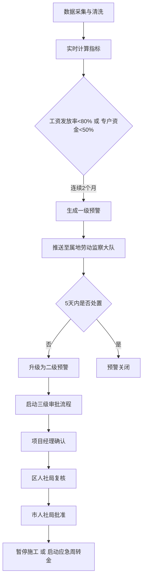
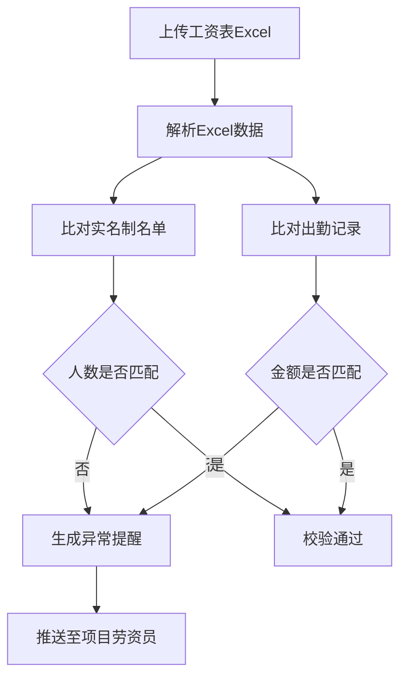

## 1. 产品概述

全国性农民工欠薪预警与工资支付保障智能分析平台，实时接入建筑项目农民工实名制考勤、工资专户流水、工程款拨付及劳动监察投诉等多源数据，通过智能分析实现欠薪风险预警、工资支付保障和监管决策支持。

- 核心目标：通过数据驱动的智能分析，提前发现欠薪风险，保障农民工工资支付权益
- 目标用户：国家、省、市三级劳动监察部门工作人员，项目劳资管理人员

## 2. 核心功能

### 2.1 用户角色

| 角色 | 登录方式 | 核心权限 |
|------|----------|----------|
| 国家级管理员 | 账号密码登录 | 查看全国数据、全局统计报表、全国预警管理 |
| 省级管理员 | 账号密码登录 | 查看本省数据、省级统计报表、本省预警管理 |
| 市级管理员 | 账号密码登录 | 查看本市数据、市级统计报表、本市预警处置 |
| 项目劳资员 | 账号密码登录 | 查看所属项目数据、上传工资表、处理异常提醒 |

### 2.2 功能模块

1. **核心看板**：全国欠薪风险热力图、工资发放排名、关键指标统计、省份下钻
2. **预警中心**：一级/二级预警列表、预警详情、三级审批流程、处置记录
3. **项目管理**：项目列表、项目详情、考勤趋势、工资发放时间线、投诉分布
4. **工资校验**：Excel上传、实名制校验、出勤校验、异常提醒
5. **周报中心**：自动生成周度报告、同比环比分析、风险诊断、优化建议
6. **系统管理**：用户管理、权限分配、数据接入配置

### 2.3 页面详情

| 页面名称 | 模块名称 | 功能描述 |
|----------|----------|----------|
| 核心看板 | 风险热力图 | 全国省份欠薪风险热力分布，支持省份切换、行业筛选 |
| 核心看板 | 关键指标卡 | 工资发放率、欠薪风险评分、专户资金比、项目总数等 |
| 核心看板 | 排名列表 | 工资发放率排名、欠薪风险排名、投诉量排名 |
| 项目详情 | 考勤趋势 | 近7天考勤人数趋势曲线图 |
| 项目详情 | 工资时间线 | 工资发放时间轴、发放金额、发放状态 |
| 项目详情 | 投诉分布 | 投诉类型饼图分布、投诉趋势 |
| 预警中心 | 预警列表 | 一级/二级预警列表、筛选、搜索 |
| 预警中心 | 审批流程 | 项目经理确认、区人社局复核、市人社局批准三级审批 |
| 工资校验 | Excel上传 | 拖拽上传工资表Excel |
| 工资校验 | 校验结果 | 人数匹配、金额匹配、异常项目列表 |
| 周报中心 | 报告列表 | 历史周报列表、查看详情 |
| 周报中心 | 报告详情 | 工资发放率同比环比、欠薪金额分布、投诉热点排名 |

## 3. 核心流程

### 3.1 预警生成与处置流程

### 3.2 工资表校验流程

## 4. 用户界面设计

### 4.1 设计风格

- 主色调：深蓝色（#1e3a5f）代表专业、信任、政务风格
- 辅助色：红色（#e53e3e）表示预警风险，绿色（#38a169）表示正常，橙色（#dd6b20）表示警告
- 字体：思源黑体（Source Han Sans）作为主要字体，配合等宽字体用于数据展示
- 布局：顶部导航 + 左侧菜单 + 主内容区的经典政务后台布局
- 视觉风格：扁平化设计，卡片式布局，数据可视化突出，适度使用渐变和阴影增加层次感

### 4.2 页面设计概览

| 页面名称 | 模块名称 | UI元素 |
|----------|----------|--------|
| 核心看板 | 风险热力图 | 中国地图热力图、省份悬停提示、点击下钻、颜色渐变图例 |
| 核心看板 | 指标卡片 | 大数字展示、趋势箭头、环比变化、卡片悬浮效果 |
| 核心看板 | 排名列表 | 排行榜样式、进度条、颜色区分等级、分页 |
| 项目详情 | 考勤趋势 | 折线图、双Y轴、数据点提示、7天时间范围 |
| 项目详情 | 时间线 | 垂直时间轴、状态标记、金额标签、动画效果 |
| 预警中心 | 预警卡片 | 红色预警标记、倒计时、处置进度条、操作按钮 |
| 工资校验 | 上传区域 | 拖拽区域、虚线边框、文件图标、上传进度 |
| 周报中心 | 报告封面 | 报告标题、生成时间、数据范围、封面装饰 |

### 4.3 响应式

- 桌面端优先设计，适配1366px及以上分辨率
- 平板端：左侧菜单可收起，图表自适应缩放
- 移动端：底部Tab导航，卡片单列布局，重要指标优先展示

### 4.4 动效设计

- 页面加载：卡片渐入动画，staggered延迟效果
- 数据更新：数字滚动动画，图表淡入效果
- 预警提示：脉冲动画，闪烁提醒
- 交互反馈：按钮悬停缩放，卡片悬浮阴影
