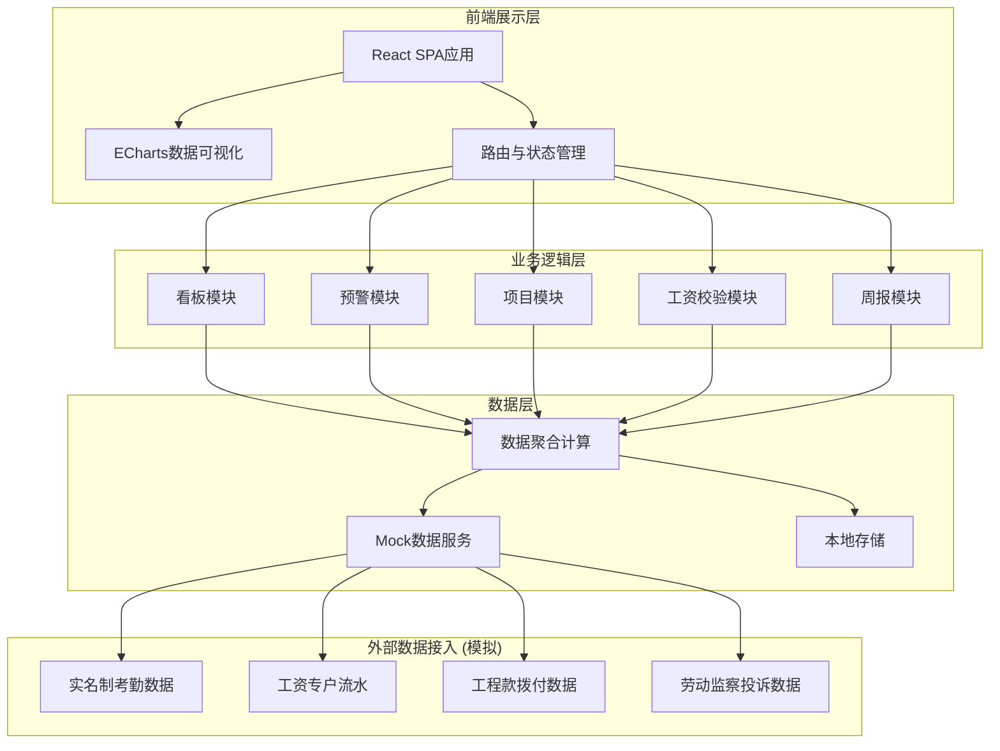

## 1. 架构设计



## 2. 技术描述

- **前端框架**：React 18 + TypeScript
- **构建工具**：Vite 5
- **样式方案**：Tailwind CSS 3
- **图表库**：ECharts 5
- **路由管理**：React Router v6
- **状态管理**：React Context + useReducer
- **UI组件库**：自定义组件（基于Tailwind CSS）
- **Excel处理**：SheetJS (xlsx)
- **图标**：Lucide React
- **数据方案**：Mock数据（前端模拟）

## 3. 路由定义

| 路由 | 页面 | 说明 |
|------|------|------|
| /dashboard | 核心看板 | 全国欠薪风险热力图、关键指标、排名 |
| /projects | 项目列表 | 项目搜索、筛选、列表展示 |
| /projects/:id | 项目详情 | 考勤趋势、工资时间线、投诉分布 |
| /warnings | 预警中心 | 预警列表、处置、审批 |
| /warnings/:id | 预警详情 | 预警信息、审批流程、处置记录 |
| /salary-verify | 工资校验 | Excel上传、校验结果、异常提醒 |
| /reports | 周报中心 | 周报列表、报告详情 |
| /system | 系统管理 | 用户管理、权限配置 |

## 4. 数据模型

### 4.1 核心数据类型

```typescript
// 项目信息
interface Project {
  id: string;
  name: string;
  province: string;
  city: string;
  district: string;
  industry: string;
  constructionUnit: string;
  totalWorkers: number;
  startDate: string;
  endDate: string;
  status: 'active' | 'completed' | 'suspended';
}

// 工资发放记录
interface SalaryRecord {
  id: string;
  projectId: string;
  month: string;
  totalAmount: number;
  paidAmount: number;
  workerCount: number;
  paidCount: number;
  paymentRate: number;
  paymentDate: string | null;
  status: 'pending' | 'paid' | 'partial' | 'overdue';
}

// 考勤记录
interface AttendanceRecord {
  date: string;
  projectId: string;
  totalWorkers: number;
  presentWorkers: number;
  attendanceRate: number;
}

// 专户资金
interface SpecialAccount {
  projectId: string;
  balance: number;
  payableAmount: number;
  fundRatio: number;
  lastUpdate: string;
}

// 预警信息
interface Warning {
  id: string;
  projectId: string;
  projectName: string;
  level: 'primary' | 'secondary';
  type: 'low_payment_rate' | 'insufficient_funds' | 'complaint';
  title: string;
  description: string;
  riskScore: number;
  createTime: string;
  status: 'pending' | 'processing' | 'resolved' | 'escalated';
  handler: string | null;
  handleDeadline: string;
  approvalFlow: ApprovalStep[];
}

// 审批步骤
interface ApprovalStep {
  id: string;
  level: 1 | 2 | 3;
  title: string;
  approver: string | null;
  status: 'pending' | 'approved' | 'rejected';
  comment: string | null;
  approveTime: string | null;
}

// 投诉记录
interface Complaint {
  id: string;
  projectId: string;
  type: string;
  description: string;
  complainant: string;
  contact: string;
  createTime: string;
  status: 'pending' | 'processing' | 'resolved';
}

// 周报
interface WeeklyReport {
  id: string;
  title: string;
  weekStart: string;
  weekEnd: string;
  generateTime: string;
  summary: {
    totalProjects: number;
    avgPaymentRate: number;
    totalWarnings: number;
    totalComplaints: number;
    paymentRateYoY: number;
    paymentRateMoM: number;
  };
  riskDistribution: RiskItem[];
  complaintRanking: ComplaintRankItem[];
  suggestions: string[];
}

// 用户
interface User {
  id: string;
  name: string;
  role: 'national' | 'provincial' | 'municipal' | 'project';
  province?: string;
  city?: string;
  permissions: string[];
}
```

### 4.2 数据聚合计算规则

1. **工资发放率** = 已发工资人数 / 应发工资人数 × 100%
2. **欠薪风险评分**（0-100）：
   - 工资发放率权重：40%
   - 专户资金比权重：30%
   - 投诉数量权重：20%
   - 工程款拨付情况权重：10%
3. **专户资金比** = 专户余额 / 应发工资总额 × 100%
4. **一级预警触发条件**：
   - 连续2个月工资发放率低于80%，或
   - 专户资金余额低于应发工资的50%
5. **二级预警触发条件**：一级预警5天内未处置

## 5. 项目结构

```
src/
├── components/          # 公共组件
│   ├── layout/         # 布局组件
│   ├── charts/         # 图表组件
│   ├── cards/          # 卡片组件
│   └── common/         # 通用组件
├── pages/              # 页面组件
│   ├── Dashboard/
│   ├── Projects/
│   ├── Warnings/
│   ├── SalaryVerify/
│   ├── Reports/
│   └── System/
├── hooks/              # 自定义Hooks
├── store/              # 状态管理
├── types/              # TypeScript类型定义
├── utils/              # 工具函数
├── mock/               # Mock数据
├── styles/             # 全局样式
└── App.tsx             # 应用入口
```
